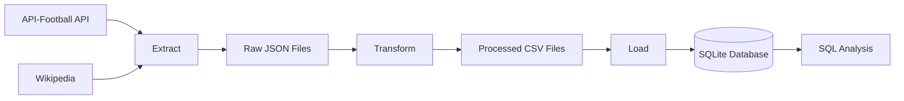
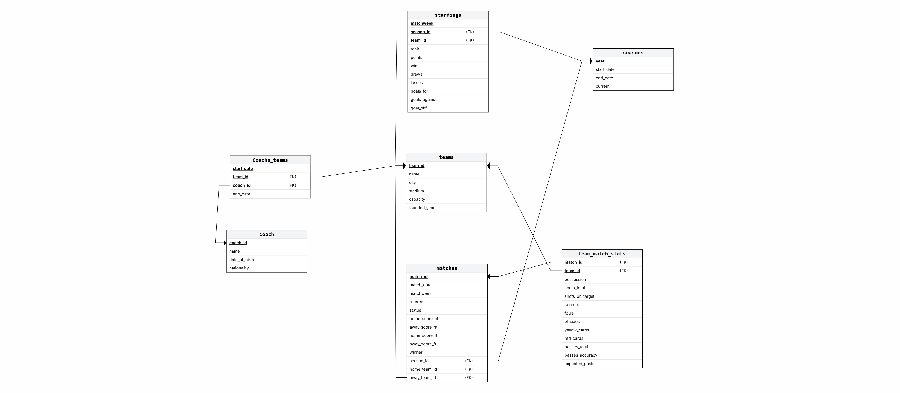

# ⚽ Premier League ETL Pipeline


A data engineering project that builds an ETL pipeline to collect, transform, and load English Premier League data into a relational SQLite database for analysis.

## Overview

This project implements an ETL (Extract, Transform, Load) pipeline for English Premier League data covering (22/23, 23/24, 24/25) seasons.

The pipeline extracts data from API-Football and other web sources, cleans and transforms it into a relational format, then loads it into a SQLite database designed for SQL analysis.

The project was built to practice real-world data engineering concepts including data extraction, transformation, database design, and automated data loading.

## Architecture

The pipeline follows the traditional ETL workflow:



The pipeline is divided into three independent stages:

- **Extract**: Collects data from API-Football and supplementary web sources.
- **Transform**: Cleans, validates, and converts raw data into normalized CSV files.
- **Load**: Creates the database schema and imports the processed data into SQLite.

## Database Schema

The project uses a normalized relational database designed to efficiently store Premier League data. The schema captures relationships between seasons, teams, matches, standings, coaches, and team statistics.

### Entity Relationship Diagram (ERD)



### Main Tables

| Table | Description |
|-------|-------------|
| `seasons` | Stores season information. |
| `teams` | Stores club details such as stadium, city, and founding year. |
| `matches` | Contains match information including scores, referee, and participating teams. |
| `standings` | Stores league standings for each matchweek. |
| `team_match_stats` | Stores detailed statistics for each team's performance in a match. |
| `coachs` | Stores coach information. |
| `coachs_teams` | Tracks coaching history for each club. |

## Project Structure

```text
premier-league-pipeline/
│
├── data/
│   ├── raw/                  # Raw data extracted from APIs and web sources
│   └── processed/            # Cleaned CSV files
│
├── database/
│   ├── schema.sql            # SQLite database schema
│   └── PLdatabase.db     # Generated database
│
├── src/
│   ├── extract.py            # Data extraction
│   ├── transform.py          # Data cleaning and transformation
│   ├── load.py               # Load data into SQLite
│   └── pipeline.py           # Run the complete ETL pipeline
│
├── .env             # Environment variables template
├── requirements.txt
└── README.md
```

### Folder Description

- **data/** – Stores both raw and processed datasets.
- **database/** – Contains the SQLite schema and generated database.
- **src/** – Contains the ETL pipeline implementation.
- **pipeline.py** – Executes the complete ETL workflow.

## Dataset

The cleaned dataset used in this project is publicly available on Kaggle for anyone interested in football analytics, SQL practice, or data engineering projects.

The dataset contains processed and normalized Premier League data covering multiple seasons, ready for analysis without requiring additional cleaning.

**Contents include:**
- Seasons
- Teams
- Matches
- Standings
- Team Match Statistics
- Coachs
- Coach-Team History

You can download the dataset here:

🔗 **Kaggle Dataset:**  
https://www.kaggle.com/datasets/eyadahmed2/premier-league-dataset/data

## Data Sources

The pipeline collects Premier League data from multiple sources:

| Source | Purpose |
|--------|---------|
| API-Football | Seasons, teams, fixtures, standings, match statistics, and player-related data. |
| Wikipedia | Manager history and coaching periods for Premier League clubs. |

## Technologies Used

- Python
- SQLite
- Pandas
- Requests
- BeautifulSoup
- JSON
- CSV
- SQL

## Features

- Extracts Premier League data from external sources.
- Cleans and transforms raw JSON into structured datasets.
- Loads processed data into a normalized SQLite database.
- Supports multiple Premier League seasons.
- Modular ETL architecture (Extract, Transform, Load).
- Designed for SQL analysis and data exploration.

## Installation

### 1. Clone the repository

```bash
git clone https://github.com/eyadAhmedCS/premier-league-pipeline.git
cd premier-league-pipeline
```

### 2. Install the required packages

```bash
pip install -r requirements.txt
```

### 3. Configure environment variables

Create a `.env` file in the project root and add your API credentials.

Example:

```env
API_KEY=your_api_key
DB_LOCATION=database/PLdatabase.db
```

## Usage

Run the complete ETL pipeline using:

```bash
python src/pipeline.py
```

The pipeline performs the following steps:

1. Extract data from external sources.
2. Transform and clean the raw data.
3. Load the processed data into the SQLite database.

## Output

After running the pipeline, the project generates:

- Processed CSV files in the `data/processed/` directory.
- A SQLite database populated with Premier League data.

## Future Improvements

The project can be extended with several enhancements, including:

- Support for additional seasons.
- Add coaches Date of birth information.
- Incremental data updates.
- Automated scheduling using Apache Airflow.
- PostgreSQL support.
- Data validation and quality checks.
- Docker containerization.
- Interactive dashboards using Power BI or Tableau.

## Acknowledgements

This project uses football data from API-Football and publicly available manager information from Wikipedia. The project was developed for educational and portfolio purposes.

## Author

**Eyad Ahmed**

Computer Science Student | Aspiring Data Engineer

- GitHub: https://github.com/eyadAhmedCS
- LinkedIn: https://www.linkedin.com/in/eyad-ahmed-304788390/
